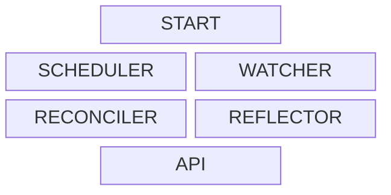

# 

[//]: # (cSpell: locale en)
[//]: # (cSpell: enableCompoundWords)
[//]: # (cSpell: ignore initd)

[![ci::status]][ci::github] [![documentation::badge]][documentation::web]

[ci::status]: https://img.shields.io/github/actions/workflow/status/georglauterbach/computer/TODO.yml?branch=master&color=green&label=CI&logo=github&logoColor=white&style=for-the-badge
[ci::github]: https://github.com/docker-mailserver/docker-mailserver/actions
[documentation::badge]: https://img.shields.io/badge/DOCUMENTATION-GH%20PAGES-0078D4?style=for-the-badge&logo=googledocs&logoColor=white
[documentation::web]: https://georglauterbach.github.io/computer

## :page_with_curl: About

>[!WARNING]
>
> This software is currently in development and should not be used in a production environment.

`initd` is a supervisor daemon for Linux - written entirely in Rust&trade; - that conforms to the UNIX philosophy of doing one thing and doing it well[^1]. `initd` supervises other processes, possibly as an init system (process with PID 1). Its main goals are:

1. **Stability**: The program is robust and reliable.
2. **Performance**: The program is efficient and fast.
3. **Integrity**: The code is well-documented, linted, tested, as well as easy to navigate and comprehend.
4. **Simplicity**: The code is easy to understand, and the program is easy to use.
6. **Fun**: Often overlooked, it should be seamless and fun to write code and to use the program.

`initd` uses YAML configuration files to fully define the processes it supervises. The code aims to be simple in structure and easy to comprehend. Hence, you should be able to effortlessly navigate it to find out more about this project.

> [!NOTE]
>
> This project draws inspiration from the computer of the _NCC-1701-D USS Enterprise_ from _Star Trek - The Next Generation_[^2]. The computer aboard the ship is a central system that manages the ship's operations. Hence, you will occasionally encounter references. Engage!

## :bookmark: Documentation

As a supervisor daemon, `initd` starts and manages so-called [services](#service-definition). Services are defined declaratively, `initd` continuously tries to establish the defined state. To reach this goals, `initd` employs [subsystems](#subsystems), each providing special functionality integral to `initd`'s operation.

### Services

#### Service Definition

A service is a description of a program and its environment. Such a description contains information about

- the [type of the program](#service-types)
- the program's name, where to find it, how to start it, how to shut it down
- what the environment that the program should run in looks like
- how to test the program's current state

#### Service Types

There are **temporary** and **permanent** services.

#### Service Lifecycle

#### Service Definitions

### Structure

#### Subsystems

`initd` consists of the following subsystems:

#### Subsystem: START

This subsystem `initd` and handles the **initialization** of `initd` itself.

#### Subsystem: SCHEDULER

This subsystem **starts, restarts and stops** [services](#service-definition).

#### Subsystem: RECONCILER

This subsystem **reacts to state changes** of services.

#### Subsystem: WATCHER

This subsystem **observes** [services](#service-definition) and publishes their state transitions.

#### Subsystem: REFLECTOR

This subsystem provides **diagnostic** functionalities.

#### Subsystem: API

This subsystems handles API requests used to interact with `initd` during run-time.

[//]: # (Glossary)

[^1]: Doug McIlroy; E. N. Pinson; B. A. Tague (8 July 1978). "Unix Time-Sharing System: Foreword". The Bell System Technical Journal. Bell Laboratories: 1902-1903 (Style).
[^2]: Memory Alpha. Computer Technology. "[LCARS](https://memory-alpha.fandom.com/wiki/Library_Computer_Access_and_Retrieval_System)".
